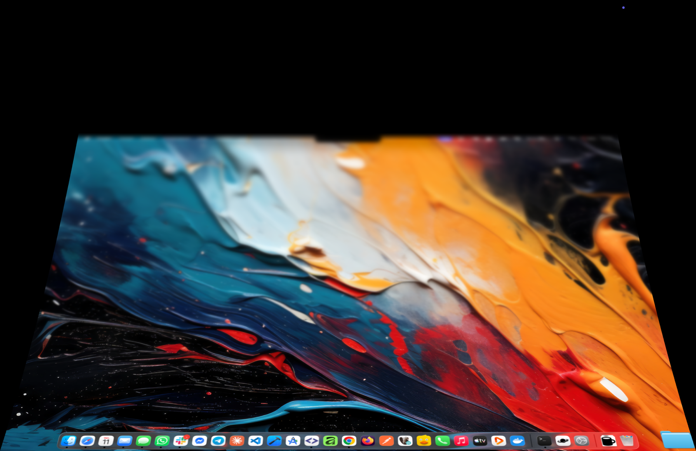

<p align="center">
  
</p>

<h1 align="center">KoffeeLid</h1>

<p align="center">
  Close the lid, keep the Mac working. Keep the screen awake when you want it. Watch the desktop fold away, iPhone Duo style.
</p>

<p align="center">
  
  
  
  
  
  
  
</p>

<p align="center">
  
</p>

## What it does

- **Keep working with the lid closed.** Arm KoffeeLid, close your MacBook, and downloads, builds, servers and
  agents keep running. The built-in display goes dark, the Mac stays awake, and the screen locks the moment you
  reopen the lid.
- **Keep the screen awake.** *Armed + screen on* adds "never sleep the display": no display sleep, no screen
  saver, no auto-lock timer, even on the login screen. One app instead of a keep-awake utility plus a lid tool.
- **An iPhone Duo-style fold on close.** Apple's foldable blurs the interface and pulls it into the new form
  factor as you close it. KoffeeLid does the same with your desktop: as the lid comes down, the desktop behaves
  like an inner screen standing still behind the glass. It stays anchored at the hinge, grows as the display
  tilts over it, narrows toward the top as it recedes, slips out of view above and blurs where the glass is furthest from it. Like
  Apple's, its edges never end on a hard line: away from the hinge they melt into the dark and the picture
  shades off toward the top, so the illusion holds from any viewing angle. It only plays
  while closing, plays backward if you reopen before the lid shuts, and nothing is captured until the lid
  actually moves. Advanced settings tune the zoom, the perspective, the blur, the edge softness, the shading
  and the angle at which the inner screen stands.
- **Arms itself while you work (opt-in).** Turn on auto-arm and KoffeeLid arms while a Claude Code session or
  a terminal command is running, and disarms again a short while after nothing is — so closing the lid
  mid-task keeps the Mac awake without you remembering to arm it first. It installs its own Claude Code hooks
  and a zsh snippet; a manual mode change always takes the arm back from it.

<p align="center">
  
</p>

## Three modes, many ways to switch

| | Off | Armed | Armed + screen on |
|---|---|---|---|
| Lid closed | Mac sleeps (macOS default) | Mac keeps working, screen dark | same as Armed |
| Lid open | nothing | normal | display never sleeps |
| Reopen | — | screen locks | screen locks, login page stays lit |

- **Fn (Globe) + close the lid** arms for a single close. Tilt the lid a few degrees while holding Fn; the fold
  appears as the lid passes the inner screen's angle (95° by default) and follows it from there. Reopening disarms.
  Never changes a mode you picked by hand.
- **Menu bar**: the cup is empty when off, full of coffee with sleepy eyes when armed, with round eyes when the
  screen is kept on, and with closed eyes while the app armed itself; each mode in the menu shows its cup in
  grey. Left-click lists the three modes with a checkmark. Right-click cycles Off → Armed →
  Armed + screen on → Off; a right-click on a mode older than three seconds goes straight to Off.
- **Shortcuts**: `⌃⌥⌘L` toggles Armed, `⌃⌥⌘K` toggles Armed + screen on. Each can be switched off in Settings.
- **Command line**: `koffeelid arm | off | caffeinate | toggle-armed | toggle-caffeinate | status | settings |
  install-hooks | uninstall-hooks | shell-init zsh` (`caffeinate` is the Armed + screen on mode; `status` also
  reports the lid, whether the sleep lock is on, and the current activity).
- **URLs and Shortcuts.app**: `koffeelid://caffeinate`, and App Intents for every verb.

## Safety rails

- **External display**: arming is allowed and the lid-sleep flag stays set, but darkening, the sound, the
  fold and the lock on reopen stand by while a monitor is connected (macOS runs its own closed-lid mode). A
  display appearing on a closed lid locks the screen immediately.
- **Low battery**: below your threshold on battery power nothing arms and an armed session ends. On AC power
  everything is allowed; unplugging below the threshold disarms at once.
- **Charger and display changes**: macOS's powerd rewrites the lid-sleep flag when the charger is plugged in
  or a display comes and goes, and the kernel then sleeps a closed Mac on the spot. KoffeeLid holds the
  session in dark wake when that happens (processes keep running, the arm stands, the lid opening brings
  everything back) and, once the sleep lock is set up (Settings › Permissions › Sleep lock › Set up…, or the
  onboarding step; your administrator password once), engages `pmset disablesleep` on every arm so that
  sleep never starts.
- **Thermal pressure**, **external sleep** (another app slept the Mac) and a **crash** all end the session and
  restore lid sleep. A watchdog LaunchAgent relaunches the app after an unclean exit, and the kernel flag is
  cleared again at the next launch.

## Settings and onboarding

First launch shows a four-page onboarding: the pitch, one **Permissions** page (Sleep lock and Login Items are
required and flagged; Screen Recording and Notifications are optional; every row has its grant button, the
page refreshes when you come back from System Settings, Skip turns into Continue once the required ones are
set), an **Arm while you work** page that sets up the Claude Code hooks and the zsh snippet, and "All set".
Settings has one page — App (launch at login), Arm with, While armed, the same **Permissions** group with live
states, and **Hooks** — plus an Advanced window for every tunable, a Diagnostics log switch,
"Show onboarding again" and "Reset permissions and undo every change…" (disarms, removes the sleep lock and its
sudoers rule, resets the Screen Recording and notification grants, unregisters the login items, clears every
setting, and reopens the onboarding).

## Install

Download `KoffeeLid-<version>.zip` from a release, unzip, drag `KoffeeLid.app` to Applications and open it.
Releases are meant to be Developer ID-signed and notarized by `script/release.sh`; until that certificate exists,
builds are signed with a development certificate and run on the developer's Mac only. Onboarding then asks for the sleep lock (administrator
password, once), Login Items (crash recovery), Screen Recording (lid effect) and notifications. Developers:
`script/install.sh` builds and installs from source; `script/release.sh` makes the notarized zip.

## Requirements

- Apple silicon MacBook, macOS 14 or later. The lid gesture and the fold animation need the built-in lid-angle
  sensor (Mac16,x and later); arming from the menu, shortcuts and CLI works on any MacBook.
- Screen Recording permission for the fold, Login Items approval for crash recovery, and the sleep lock
  (one administrator password): all from the onboarding or Settings › Permissions.

## Build from source

```sh
script/bootstrap.sh     # installs xcodegen if needed and generates KoffeeLid.xcodeproj
swift test              # KoffeeLidCore + LidPlaneKit unit tests
script/install.sh       # Release build → /Applications/KoffeeLid.app (+ /usr/local/bin/koffeelid wrapper)
open -a KoffeeLid
```

`install.sh` refuses to replace a running, armed instance (`FORCE=1` overrides). If `/usr/local/bin` is not
writable it prints the one `sudo` line that creates the `koffeelid` wrapper.

## How it works

While armed, KoffeeLid sets the IOPMrootDomain lid-sleep flag (`kPMSetClamshellSleepState`, external method
12), holds `PreventUserIdleSystemSleep` and `PreventSystemSleep` assertions, darkens the built-in panel through
DisplayServices when the lid closes, and locks through loginwindow on reopen. Armed + screen on adds a
`PreventUserIdleDisplaySleep` assertion and a periodic user-activity declaration while the lid is open. The
fold is a Metal plane fed by ScreenCaptureKit, driven by the lid-angle sensor at 30 Hz and interpolated per
frame. Everything that returns the app to Off also clears the kernel flag; see `docs/architecture.md`.

## Documentation

- `CLAUDE.md` — orientation, commands, invariants (start here)
- `docs/architecture.md` — modules, arming state machine, kernel-flag ownership, effect wiring, threading
- `docs/development.md` — build/install/debug loop, adding preferences, strings and controls
- `docs/platform-notes.md` — the macOS mechanisms it relies on and how they were verified
- `docs/gesture.md` — the Fn + close detector, its states and the softlock post-mortem
- `docs/manual-checks.md` — hardware verification checklist

## Notes

- Personal build: signed with a development certificate, not notarized, English and French only.
- Any other utility that disables lid-close sleep drives the same kernel flag; do not arm two at once.
- Sound effects are free to use (`App/Resources/Sounds/SoundEffects-LICENSE.txt`).
