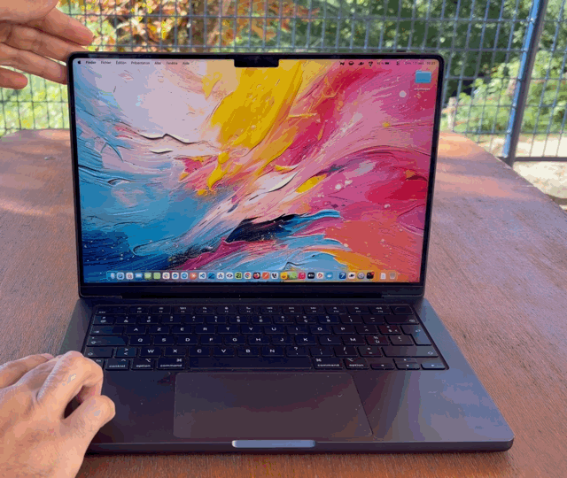
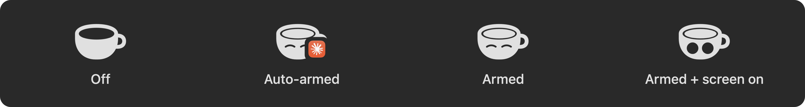

<p align="center">
  
</p>

<h1 align="center">KoffeeLid</h1>

<p align="center">
  <strong>Close the lid. The work goes on.</strong><br>
  A menu-bar app that keeps your MacBook awake with the lid shut — on its own while Claude Code or a
  terminal command is running — and folds the desktop away like the iPhone Duo closing, with a sound to match.
</p>

<p align="center">
  <a href="https://github.com/bambidotexe/koffeelid/releases/latest"></a>
  
  
  
  
  
</p>

## The problem

You start a long turn in Claude Code, a build, a deploy, a download. Then you close the lid to go make a coffee,
catch a train, or move to the couch with your phone. macOS puts the Mac to sleep, the session dies, and the
prompt you send from your phone twenty minutes later lands on a machine that is no longer listening.

KoffeeLid keeps the Mac awake with the lid closed, and — this is the point — knows *when* to do it.

## It arms itself while you work

This is the headline feature. Set it up once, from onboarding or Settings › Hooks, and KoffeeLid watches two
things:

- **Claude Code.** Hooks in `~/.claude/settings.json` report every session event — a prompt sent, a tool
  running, a turn finished. While a session is working, the Mac is armed. When the turn ends, KoffeeLid waits **30 minutes**
  before letting go, so a follow-up prompt sent from your phone still finds the Mac awake.
- **The terminal.** A zsh snippet reports every command that runs longer than a few seconds, as it starts and ends. A `make`, a `docker
  compose up`, a `rsync` — closing the lid while one runs no longer kills it. When the command finishes,
  KoffeeLid waits a minute, then stands down.

You never touch the menu bar. The cup up there just changes its face while the app is holding the Mac awake
for you, and goes back to empty when there is nothing left to wait for. Come back and touch the keyboard
or trackpad during the wait, and the wait ends on the spot — the hold-off exists for the remote you, not the
one sitting at the desk.

Two things make this trustworthy:

- **A manual choice is never overruled.** Pick Off, Armed, or Armed + screen on by hand and the auto-arm runs
  alongside it, never instead of it. The Mac is armed while *either* says so.
- **"Disarm once finished."** One menu item for the evening: the current work finishes, a minute passes, and
  everything ends — the auto-arm skips its long wait, the manual mode releases too.

## The close deserves a show

<p align="center">
  
</p>

The iPhone Duo pulls its interface into the new shape as you fold it shut. KoffeeLid does the same with your
desktop, iPhone Duo style. As the lid comes down, the desktop behaves like an **inner screen standing still behind the glass**:
anchored at the hinge, it grows as the display tilts over it, narrows toward the top as it recedes, slips out of
view above and blurs where the glass is furthest from it. The edges never end on a hard line — they melt into the
dark, the picture shades off toward the top — so the illusion holds from any angle you look at it.

It plays only while closing, runs backward if you change your mind before the lid shuts, and captures nothing
until the lid actually moves. A rendering pass in Metal, fed by the lid-angle sensor and smoothed per frame.

And it has a **sound**. Six short clips to choose from — a blip, a bloop, a chime, a tick… — played at the moment
the lid shuts. Optionally at a fixed volume, so the close sounds the same whether the Mac was muted or blaring.

**Fn (Globe) + close** arms for a single close without changing anything else: hold Fn, tilt the lid, and the
fold appears as it passes the inner screen's angle. Reopening disarms. Ideal when you did not set up auto-arm,
or when you want the show on a Mac that is otherwise Off.

## Three modes

<p align="center">
  
</p>

| | Off | Armed | Armed + screen on |
|---|---|---|---|
| Lid closed | Mac sleeps (macOS default) | Mac keeps working, screen dark | same |
| Lid open | nothing | normal | display never sleeps, no screen saver, no auto-lock |
| Reopen | — | screen locks | screen locks, login page stays lit |

*Armed + screen on* replaces the keep-awake utility you were running next to your lid tool: one app, one cup.

Switch however you like:

- **Menu bar** — left-click picks a mode, right-click cycles Off → Armed → Armed + screen on → Off (a
  right-click on a mode older than three seconds goes straight to Off).
- **Shortcuts** — `⌃⌥⌘L` toggles Armed, `⌃⌥⌘K` toggles Armed + screen on. Each has its own switch.
- **Command line** — `koffeelid arm | off | caffeinate | toggle-armed | toggle-caffeinate | status | settings |
  install-hooks | uninstall-hooks | shell-init zsh`. `status` reports the mode, the lid, the sleep lock and
  what is currently keeping the Mac awake (`auto-armed (activity) · activity: 1 session working, 1 command`).
- **URLs and Shortcuts.app** — `koffeelid://caffeinate`, and App Intents for every verb.

## It gets out of the way when it should

- **External display** — arming is allowed, but the darkening, the sound, the fold and the lock on reopen stand
  by while a monitor is connected (macOS runs its own closed-lid mode). A display appearing on a closed lid
  locks the screen immediately.
- **Low battery** — below your threshold on battery power nothing arms and an armed session ends. On AC power
  everything is allowed; unplugging below the threshold disarms at once.
- **Charger and display changes** — macOS rewrites the lid-sleep flag when the charger is plugged in or a
  display comes and goes, and the kernel then sleeps a closed Mac on the spot. KoffeeLid holds the session in
  dark wake when that happens and, once the sleep lock is set up (one administrator password, from onboarding or
  Settings › Permissions), engages `pmset disablesleep` on every arm so that sleep never even starts.
- **Thermal pressure, external sleep, a crash** — all end the session and restore lid sleep. A watchdog
  relaunches the app after an unclean exit, and the kernel flag is cleared again at the next launch.

Everything that returns the app to Off also clears the kernel flag. That rule has no exceptions in the code.

## Install

Download `KoffeeLid-<version>.dmg` from the [latest release](https://github.com/bambidotexe/koffeelid/releases/latest),
open it, drag `KoffeeLid.app` to Applications and launch it. A four-page onboarding asks for what it needs: the
sleep lock (administrator password, once), Login Items (crash recovery), Screen Recording (the fold),
notifications (optional), and offers to set up the Claude Code hooks and the zsh snippet.

The current build is signed with a development certificate and is not notarized. On another Mac, macOS will
warn; control-click the app and choose Open, or build from source.

## Requirements

- Apple silicon MacBook, macOS 14 or later. The lid gesture and the fold need the built-in lid-angle sensor
  (Mac16,x and later); arming from the menu, the shortcuts, the CLI and the hooks works on any MacBook.
- Screen Recording permission for the fold, Login Items approval for crash recovery, and the sleep lock (one
  administrator password): all from the onboarding or Settings › Permissions.
- For auto-arm: Claude Code (the hooks go into `~/.claude/settings.json`, backed up first) and zsh (the snippet
  goes into `~/.zshrc`, between two `# ---------- KoffeeLid ----------` lines it owns). Both are removable from
  Settings with one button.

## Build from source

```sh
script/bootstrap.sh     # installs xcodegen if needed and generates KoffeeLid.xcodeproj
swift test              # KoffeeLidCore + LidPlaneKit unit tests
script/install.sh       # Release build → /Applications/KoffeeLid.app (+ /usr/local/bin/koffeelid wrapper)
open -a KoffeeLid
```

`install.sh` refuses to replace a running, armed instance (`FORCE=1` overrides). If `/usr/local/bin` is not
writable it prints the one `sudo` line that creates the `koffeelid` wrapper.

## How it works

While armed, KoffeeLid sets the IOPMrootDomain lid-sleep flag (`kPMSetClamshellSleepState`, external method
12), holds `PreventUserIdleSystemSleep` and `PreventSystemSleep` assertions, darkens the built-in panel through
DisplayServices when the lid closes, and locks through loginwindow on reopen. Armed + screen on adds a
`PreventUserIdleDisplaySleep` assertion and a periodic user-activity declaration while the lid is open. The
auto-arm is a tiny helper binary invoked by the hooks and the shell snippet; it appends one line to an activity
journal and never launches anything. The fold is a Metal plane fed by ScreenCaptureKit, driven by the lid-angle
sensor at 30 Hz and interpolated per frame. See `docs/architecture.md`.

## Documentation

- `CLAUDE.md` — orientation, commands, invariants (start here)
- `docs/architecture.md` — modules, arming state machine, kernel-flag ownership, effect wiring, threading
- `docs/development.md` — build/install/debug loop, adding preferences, strings and controls
- `docs/platform-notes.md` — the macOS mechanisms it relies on and how they were verified
- `docs/gesture.md` — the Fn + close detector, its states and the softlock post-mortem
- `docs/manual-checks.md` — hardware verification checklist

## Notes

- Personal build: English and French, no updater, no licensing.
- Any other utility that disables lid-close sleep drives the same kernel flag; do not arm two at once.
- Sound effects are free to use (`App/Resources/Sounds/SoundEffects-LICENSE.txt`).
